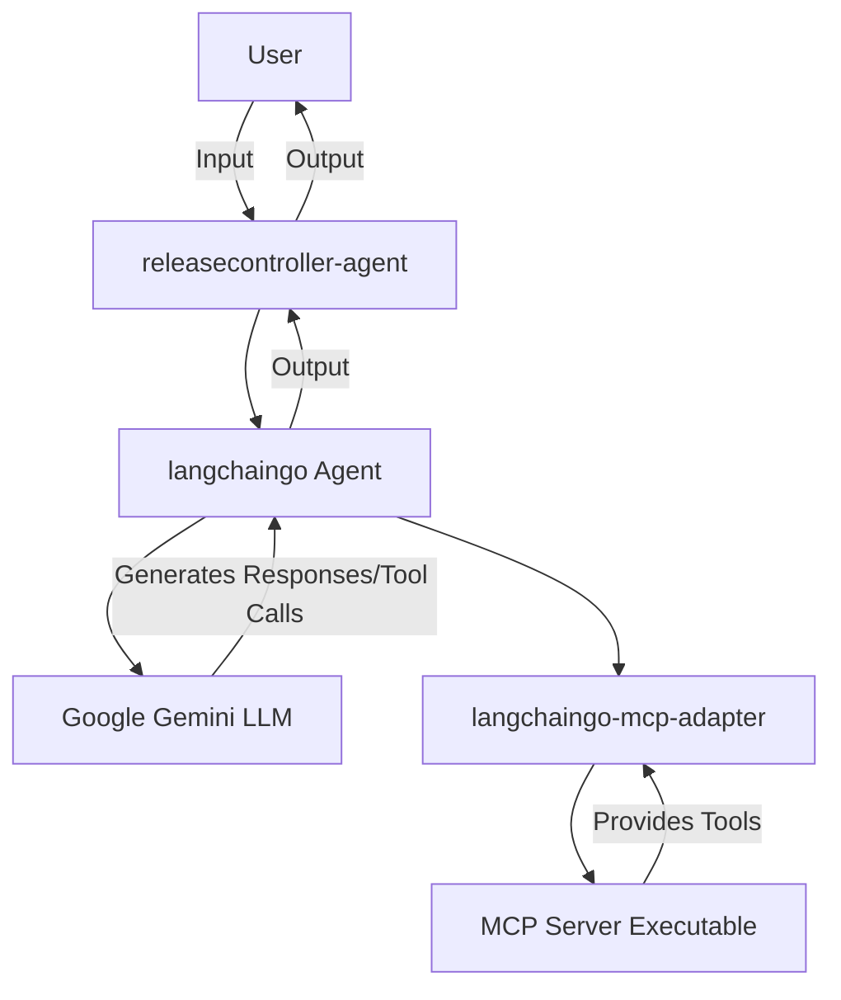

# Releasecontroller Agent
releasecontroller-agent is a conversational agent built with langchaingo that leverages the langchaingo-mcp-adapter to connect to the [releasecontroller-mcp-server](https://github.com/Prashanth684/releasecontroller-mcp-server). This allows the agent to utilize tools exposed by the MCP server for analysis and generating intelligent responses, powered by Google's Gemini LLM.

## Architecture Diagram:


## Features:

Conversational Agent: Interacts with users in a natural language.

Tool Calling: Integrates with an MCP server to access and execute various tools.

Google Gemini Integration: Uses a specified Gemini model (gemini-2.5-flash by default) for language understanding and generation.

Extensible: Easily extendable by adding more tools to the MCP server.

## Prerequisites

Before running this agent, ensure you have:

Go installed: This project is written in Go.

MCP Server Executable: A compiled MCP server executable (e.g., releasecontroller-mcp-server) must be present and accessible in your system's PATH, or its path explicitly provided in main.go.

Gemini API Key: An API key for Google Gemini.

## Setup and Installation

Clone the repository:

git clone <your-repo-url>
cd releasecontroller-agent

Set your Gemini API Key:
Export your Gemini API key as an environment variable:

export GEMINI_API_KEY="YOUR_GEMINI_API_KEY"

Build the application:

go build -o releasecontroller-agent .

## Usage
Run the compiled agent:

./releasecontroller-agent

The agent will start and prompt you for input. Type your queries and press Enter. To exit the conversation, type exit.

```
Attempting to initialize MCP client with executable at releasecontroller-mcp-server...
Successfully initialized MCP client.
Successfully created main agent LLM adapter.
Starting conversational agent. Type 'exit' to quit.
This agent requires an MCP server executable at the specified path and a set GEMINI_API_KEY environment variable.

You: what can you do
Agent:  I can assist with a wide range of tasks related to OpenShift and Kubernetes cluster analysis, and release information. Here are some examples of what I can do:

**Cluster Information and Troubleshooting:**
*   Get summaries of cluster operators (available, progressing, degraded).
*   Get cluster version summaries (current, desired, updates).
*   Retrieve information about nodes (architecture, OS, kernel, annotations, labels, conditions).
*   List pods in a specific namespace, on a particular node, or in a specific state (e.g., CrashLoopBackOff, Pending, Running).
*   Get details about containers within a pod and analyze their logs for important events or errors.

**Release and Job Analysis:**
*   Find release controller URLs for different architectures (OCP, OKD, ARM64, PPC64LE, S390X, Multi-arch).
*   List available release controllers and their streams.
*   Get the latest accepted or rejected releases for a given stream.
*   Analyze job failures from Prow URLs, providing summaries of errors.
*   List flaky tests, failing tests, and risk analysis data for Prow jobs.
*   List failed jobs in a specific release.
*   List components (kubectl, kubernetes, coreos, tests) in a release.
*   Identify bugs, CVEs, and features from updated image commits in a release.

**General Capabilities:**
*   Engage in natural-sounding conversations.
*   Provide in-depth explanations and discussions on various topics.
*   Generate human-like text based on input.

Essentially, I can help you query and analyze data related to OpenShift clusters and their release processes, as well as answer general questions.
```

## Configuration
mcpServerExecutablePath: (in main.go) Specifies the path to your MCP server executable. Defaults to "releasecontroller-mcp-server".

geminiModelName: (in main.go) Sets the Google Gemini model to use. Defaults to "gemini-2.5-flash". You can change this to other available models like "gemini-1.5-pro".

GEMINI_API_KEY: (Environment Variable) Your Google Gemini API key. Required.
